# Stock Market Management System

Stock Market Management System is a Python application that allows users to manage their stock portfolios, buy and sell shares of different companies, and track their wallet balances. This project is built using the CustomTkinter library for the graphical user interface and interacts with a MySQL database for user registration and data storage.

## About Me
> **Name:** Prem Ganesh Gaikwad
>> **Affiliated with:** SCTR's Pune Institute of Computer Technology 
>>> **Educational Background:** Bachelor of Engineering (E&TE)
>>>> **Honors:** Artificial Intelligence and Machine Learning 

## Table of Contents

> [About Me](#about-me)

> [Features](#features)

> [Installation](#installation)

>[Usage](#usage)

> [Database Setup](#database-setup)

> [ER Diagram](#erd)

> [Screenshots](#screenshots)

> [Process Flow Diagram](#process-flow-diagram)

> [Future Scope](#future-scope)

> [License](#license)

## Features

- User registration with details like full name, PAN card, Aadhar number, phone number, and initial balance.
- User login with phone number and password authentication.
- Display of the user's wallet balance.
- Buying and selling shares of different companies, with stock prices fetched from a database.
- Managing the user's portfolio, displaying the number of shares owned for each company.
- Option to add money to the wallet.
- User-friendly graphical user interface with a dark and light theme.

## Installation

1. Clone the repository to your local machine:

   ```bash
   git clone https://github.com/Prem07a/Stock_Mangement_app.git
   ```

2. Install the required Python libraries:

   ```bash
   pip install -r ./requirements.txt
   ```

3. Database Setup:
   - Create a MySQL database.
   - Import the SQL script `stock_market_db.sql` provided in the repository to set up the database schema.
   - Update the database credentials in the `database_credentials.txt` file with the appropriate information, including the host, user, and password.

4. Run the application:

   ```bash
   python app.py
   ```

## Usage

- Upon launching the application, you can choose to either log in or sign up.
- If you are a new user, click on "Sign-Up" to register with your personal details and an initial balance.
- If you are an existing user, click on "Login" and enter your phone number and password to access your account.
- After logging in, you can view your wallet balance and your stock portfolio.
- You can also buy and sell shares of different companies from the available list.

## Database Setup

To set up the database, follow these steps:

1. Create a MySQL database.

2. Run the SQL script `Create.sql` provided in the repository on your MySQL workbench. This script will create the necessary tables and schema for the application.

3. Update the `database_credentials.txt` file with the correct database credentials, including the host, user, and password. This file is used by the application to connect to the database.

## ERD

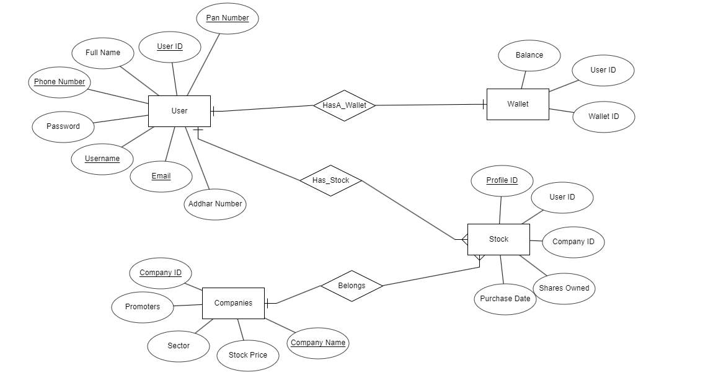

## Screenshots

### Home Page
#### Dark Theme
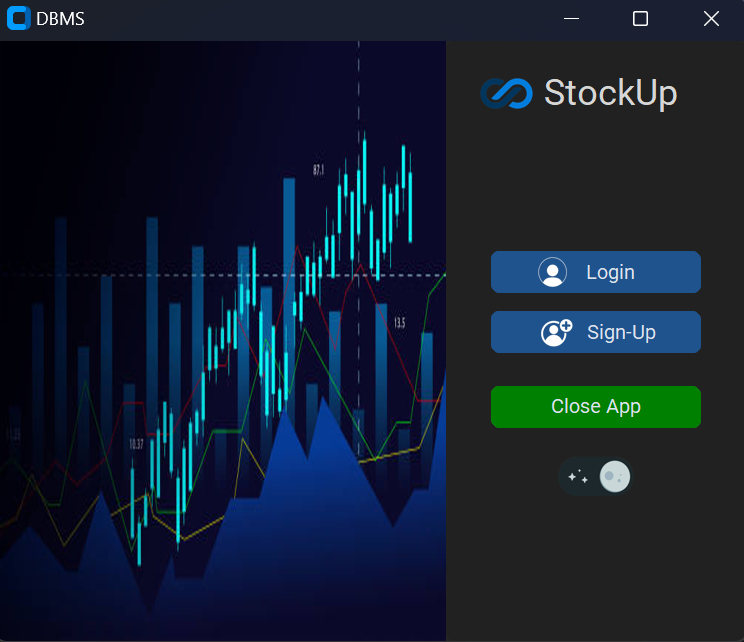
#### Light Theme
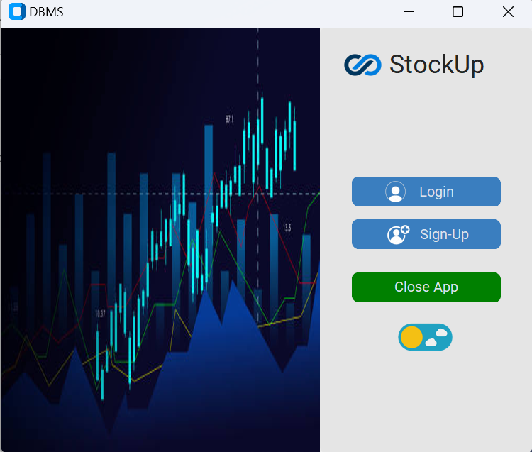

### Login Page
#### Dark Theme
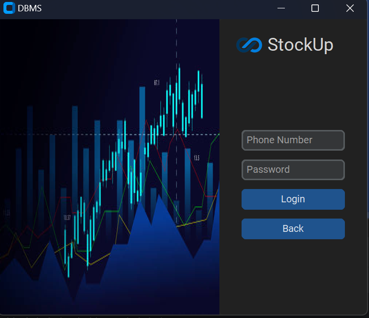
#### Light Theme
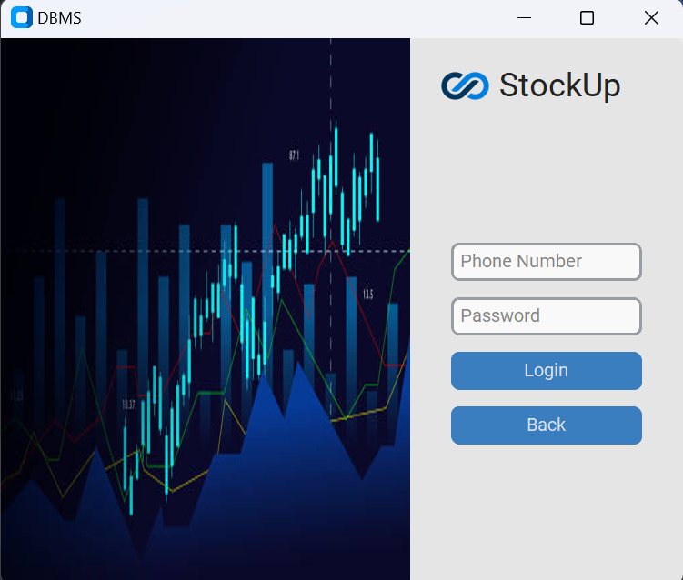

### Sign-Up Page
#### Dark Theme
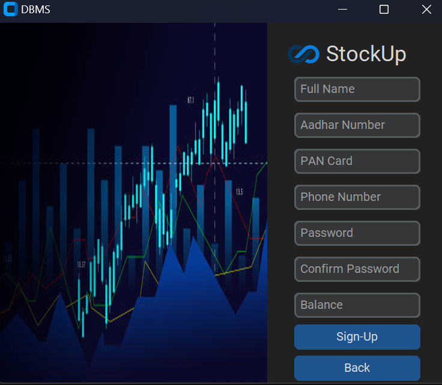
#### Light Theme
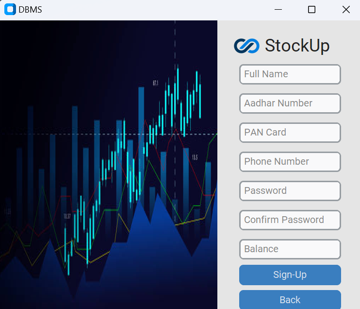

### Dashboard
#### Dark Theme
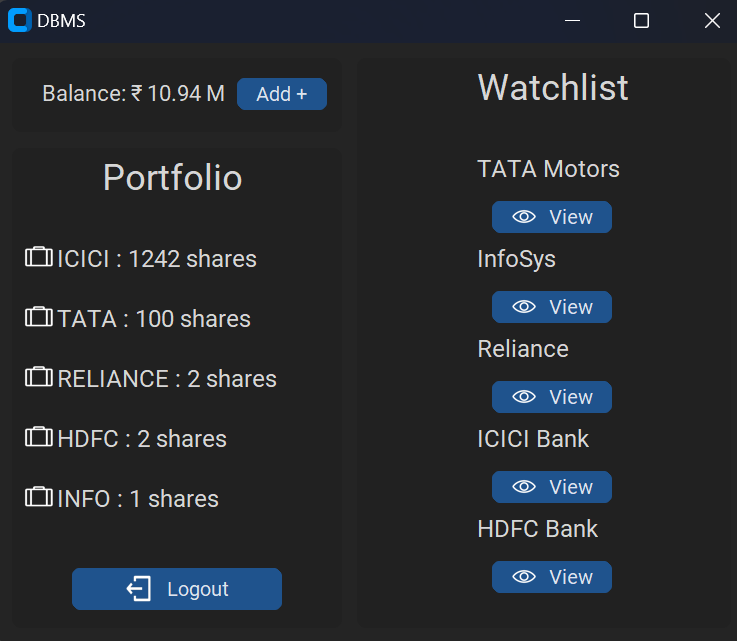
#### Light Theme
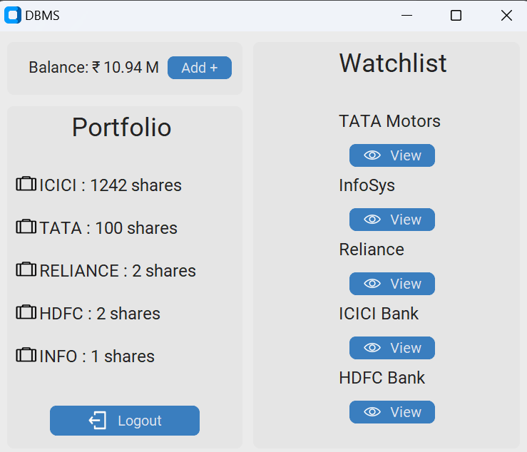

### Orders
#### Dark Theme <br>
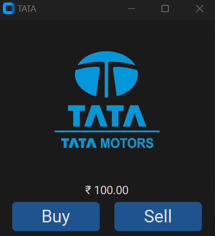
#### Light Theme <br>
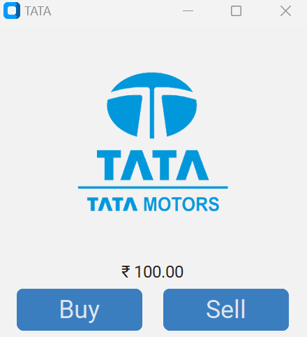

## Process Flow Diagram

### Login/Sign-up Workflow
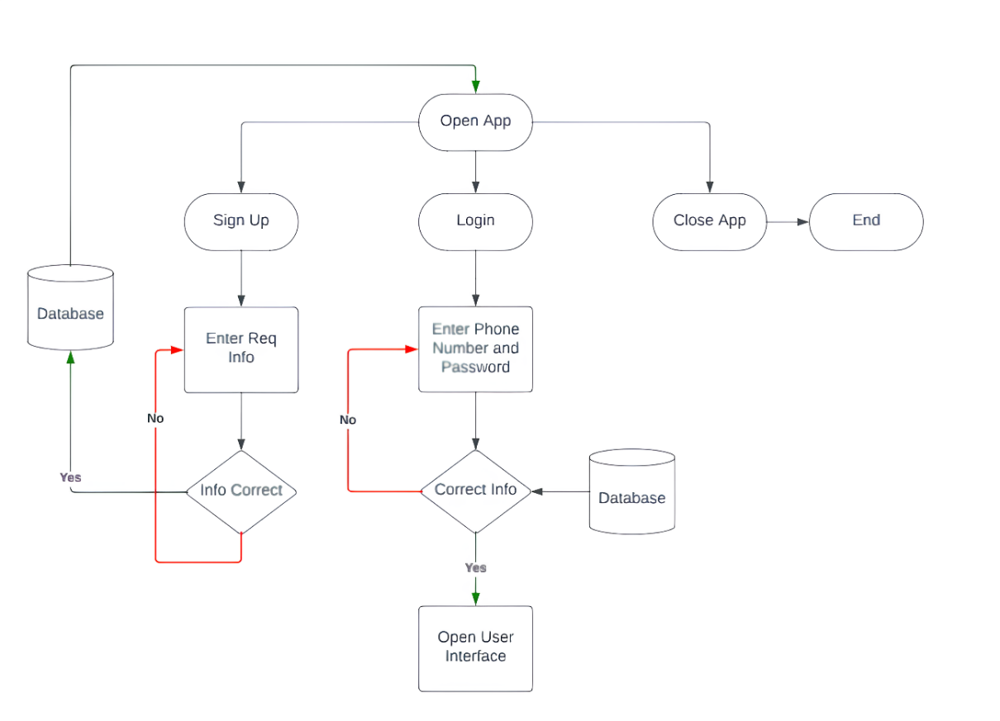

### Order Workflow
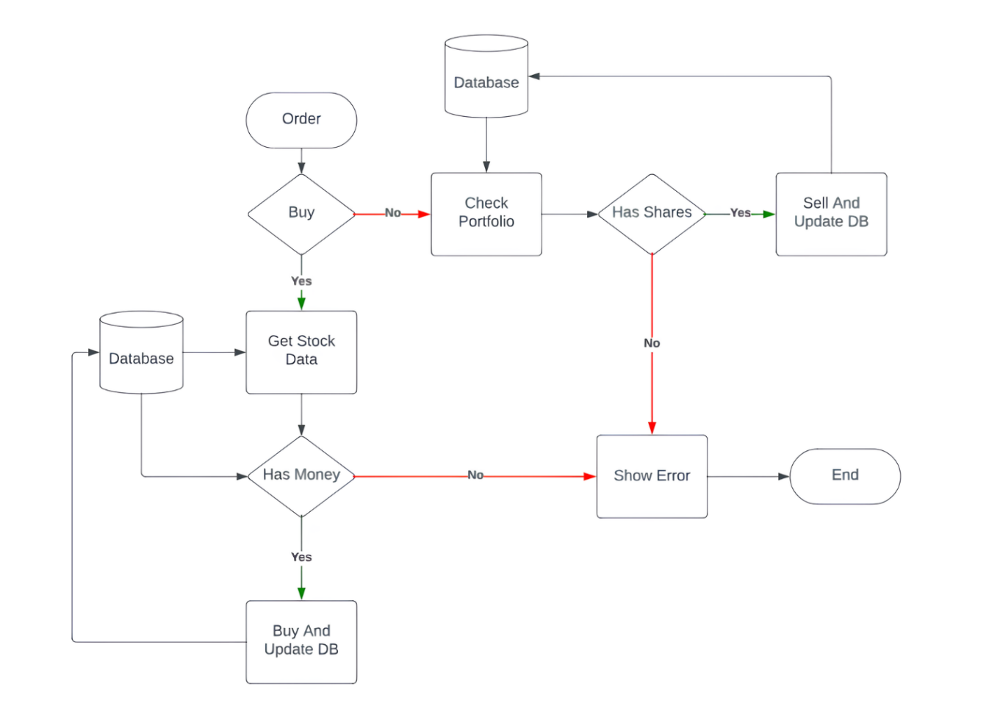

## Future Scope

The `StockUp` project provides a foundation for a stock trading and portfolio
management application. While the current version fulfills the initial requirements, there
is significant potential for further development and enhancements. Here are some future
scope possibilities for the project:
>1. **Enhanced User Profiles**:
 - Implement more comprehensive user profiles, including personal information,
investment preferences, and risk tolerance.
 - Provide options for users to link their real brokerage accounts for live trading.
>2. **Real-Time Data Integration**:
 - Integrate with real-time stock market data providers to offer users actual market data.
 - Implement features like live stock quotes, real-time charts, and news feeds.
>3. **Advanced Trading Features**:
 - Add advanced trading options, such as limit orders, stop-loss orders, and trailing stop
orders.
 - Implement technical analysis tools for users to make informed trading decisions.
>4. **Security Enhancements**:
 - Enhance security measures to protect user data and financial information.
 - Implement two-factor authentication and encryption for sensitive data.
>5. **Educational Resources**:
 - Create a section for educational resources, including articles, tutorials, and webinars
on stock trading and investment strategies.
>6. **Gamification and Rewards**:
 - Implement gamification elements to make the app more engaging.
 - Reward users for reaching trading milestones or achieving certain goals.

## License

[MIT License](LICENSE)

`© Prem Gaikwad 2023`
